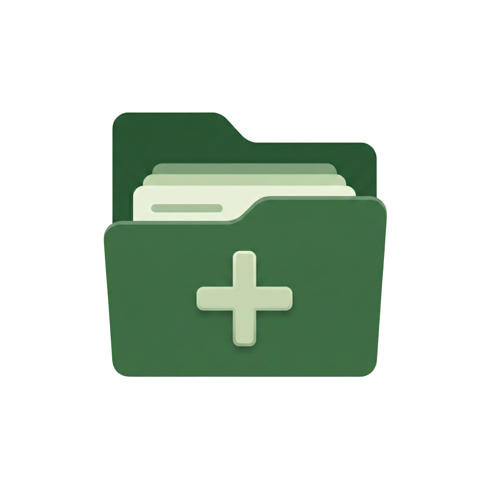

  
  <h1>MyFiles+</h1>

A modern, fast, and lightweight File Manager for Android, built with **Jetpack Compose** and **Material You (Material 3)**.

## 🚀 Features

*   **Material You Design**: Dynamic colors, modern UI components, and smooth animations.
*   **Swipe Navigation**: Seamlessly swipe between Home, Recents, Bin, and Settings tabs (configurable).
*   **Storage Dashboard**: Visual breakdown of storage usage with color-coded categories and forecast capabilities.
*   **Smart Cleaning**:
    *   **Ghost Files**: Detect and remove empty folders.
    *   **Large Files**: Identify and manage large files consuming space.
    *   **Liquid Animations**: Satisfying cleaning animations.
*   **Video Previews**: Instant video thumbnails.
*   **Secure Trash Bin**: Deleted files move to the Bin first, allowing for easy restoration.
*   **Dark Mode**: Fully supported system-wide dark theme and AMOLED black mode.

## 🛠️ Tech Stack

*   **Language**: Kotlin
*   **UI Toolkit**: Jetpack Compose (Material3)
*   **Architecture**: MVVM
*   **Image Loading**: Coil
*   **Navigation**: Navigation Compose
*   **Data Storage**: DataStore Preferences, MediaStore API

## 📸 Screenshots

## 📦 Setup

1.  Clone the repository.
2.  Open in **Android Studio**.
3.  Sync Gradle.
4.  Run on an Android device or emulator (Android 10+ recommended).

## 🤝 Contributing

Contributions are welcome! Please open an issue or submit a pull request.
