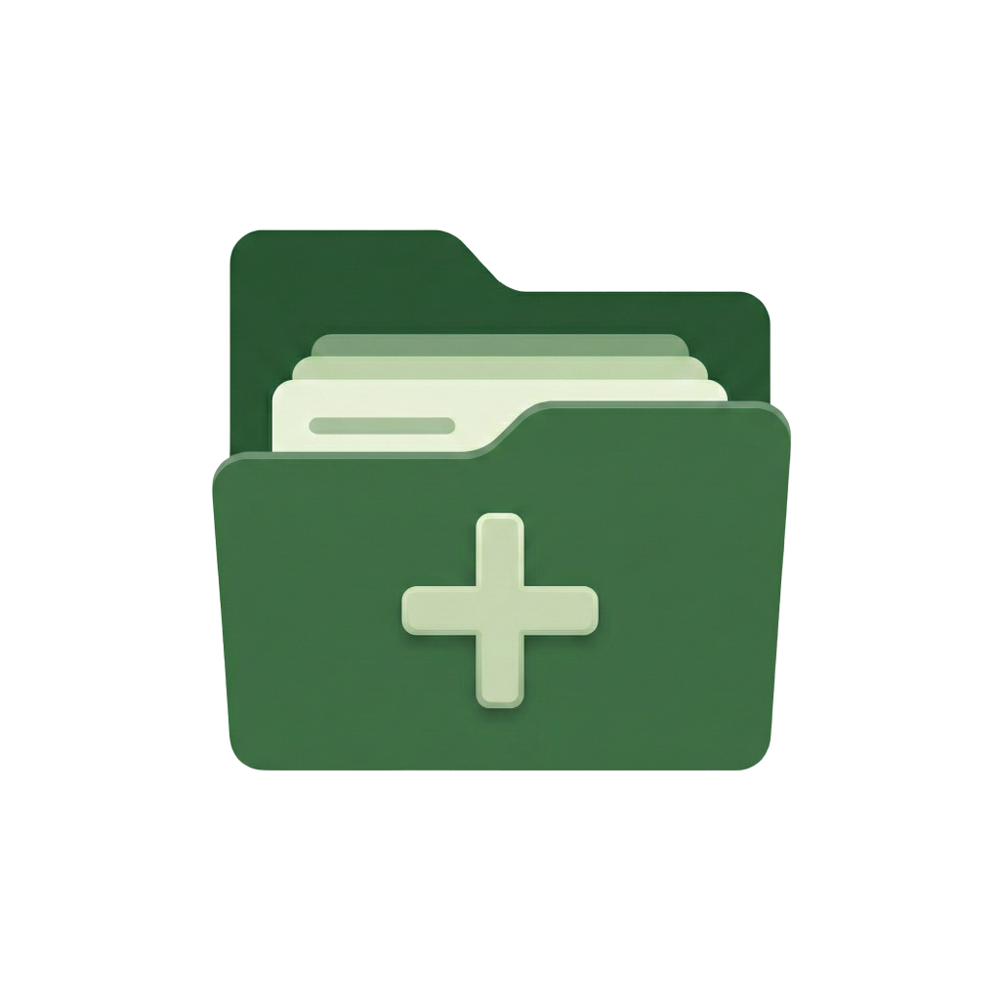
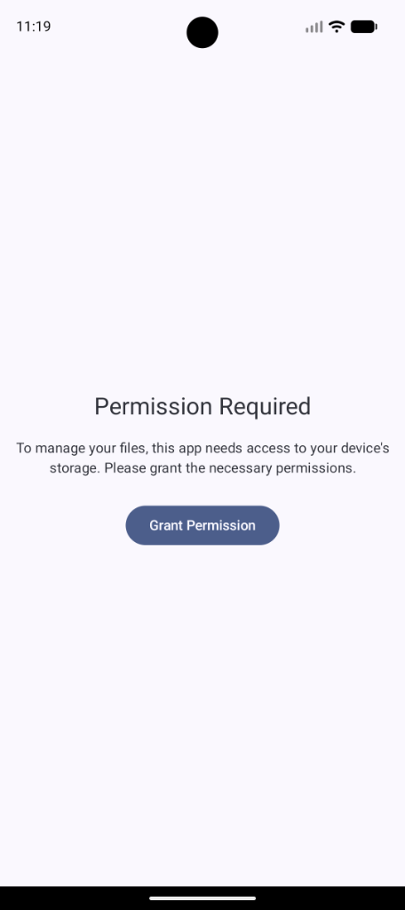
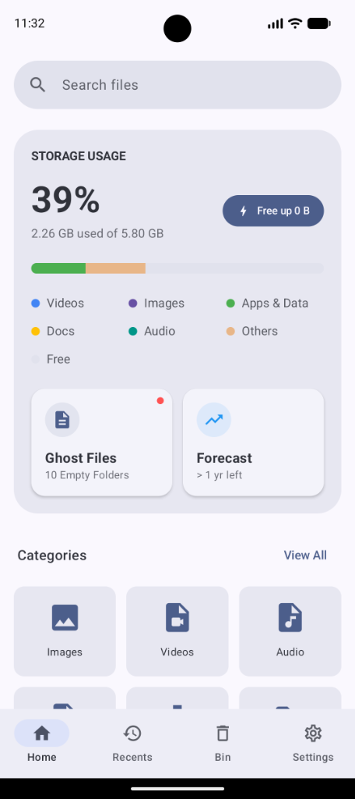
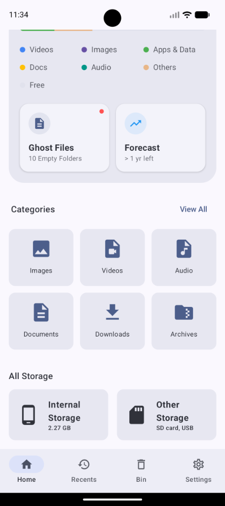
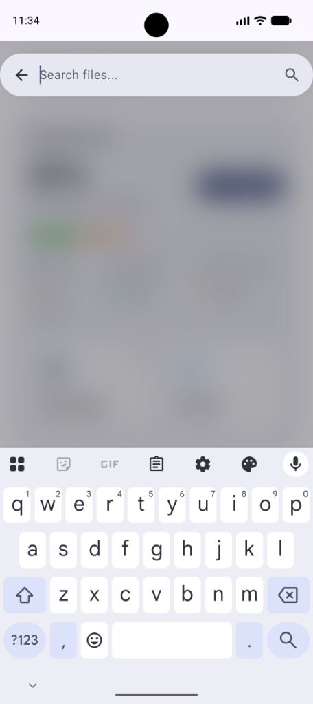
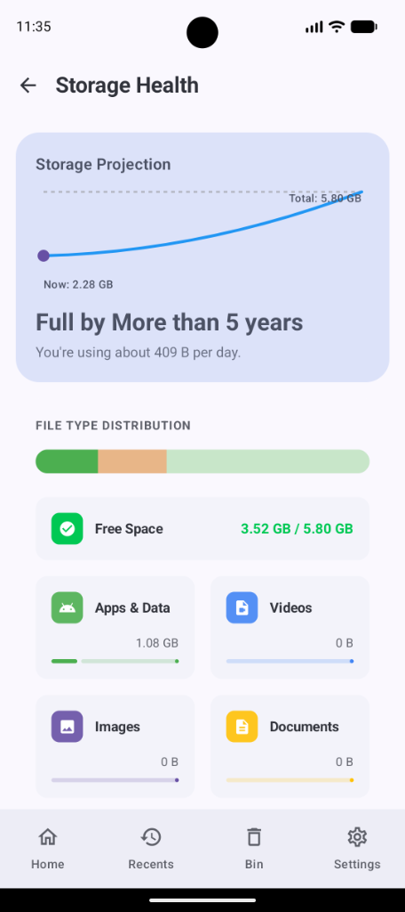
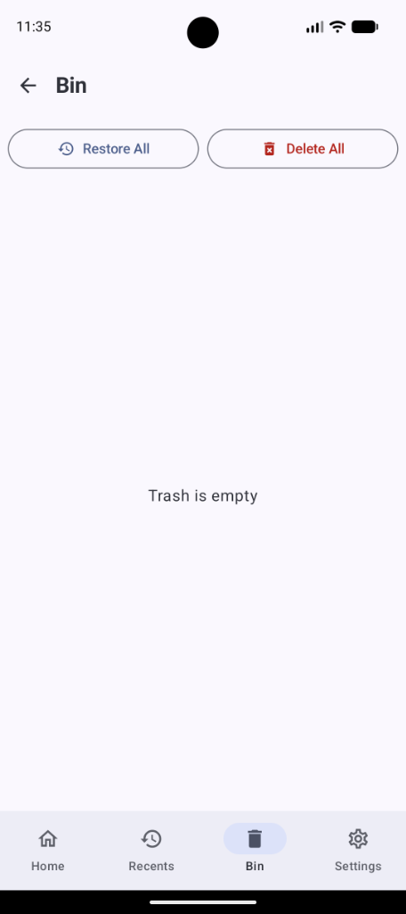
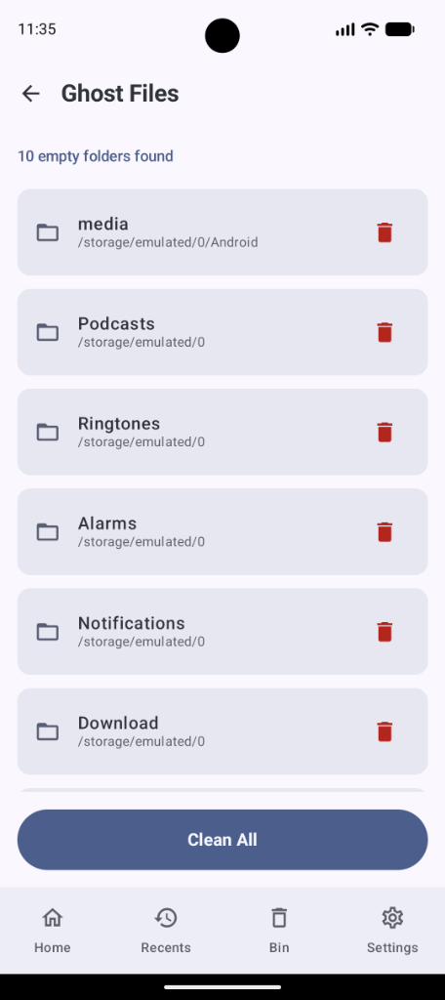
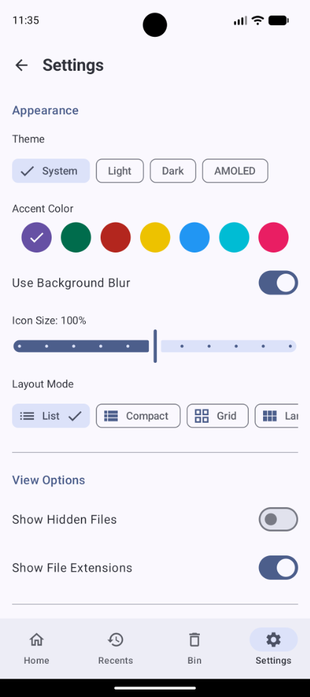

<div align="center">
  
  <h1>MyFiles+</h1>
  <p><b>A flagship-grade, private, and powerful File Manager for Android.</b></p>
  
  [](https://github.com/Kpcodo/MyFilesplus/releases)
  [](https://developer.android.com/about/versions/nougat)
  [](https://kotlinlang.org/)
  [](https://m3.material.io/)
</div>

---

**MyFiles+** is a modern, fast, and lightweight File Manager built for the modern Android ecosystem. Designed with **Material Components**, it provides a seamless, fluid experience while offering desktop-class file management capabilities right in your pocket.

## ✨ Features

### 📁 Advanced File Management
- **Seamless Navigation**: Fluid navigation to switch between Browser, Recents, Trash, and Settings.
- **Batch Operations**: Copy, move, rename, and delete multiple files with high-performance execution.
- **Deep Search**: Instant search to locate files effortlessly.
- **Archive Support**: Full integration for ZIP extraction and management.
- **Secure Bin**: Built-in trash system to prevent accidental data loss with easy restoration.

### 📊 Storage Insights & Health
- **Storage Forecast**: Analyze and predict storage usage over time.
- **Storage Health**: Identify large files and unwanted media that are consuming valuable space.

### 🧹 Intelligent Cleaning
- **Large File Finder**: Quickly identify and remove space-intensive files.
- **Background Operations**: Smooth file transfers and cleaning processes powered by Kotlin Coroutines.

### 📦 Integrated Media & Viewers
- **Media Previews**: Instant high-quality thumbnails using Coil.
- **Built-in Players**: Native support for image viewing, and a dedicated audio/video player powered by Media3 (ExoPlayer).

### 💅 Premium Design & Experience
- **Material Design 3**: Modern UI components with comprehensive Material 3 integration.
- **Responsive UI**: Blazing fast interactions with optimized background layouts for a zero-lag feeling.

## 🛠️ Tech Stack

- **UI Framework**: Android View System (XML Layouts & View Binding)
- **Architecture**: MVVM (Model-View-ViewModel) Architecture
- **Asynchronous Logic**: [Kotlin Coroutines](https://kotlinlang.org/docs/coroutines-overview.html) & Flow
- **Image Loading**: [Coil](https://coil-kt.github.io/coil/) (Optimized for Android)
- **Media Playback**: [Media3 & ExoPlayer](https://developer.android.com/guide/topics/media/media3)
- **Networking**: [Ktor Client](https://ktor.io/)
- **Data Persistence**: [Jetpack DataStore](https://developer.android.com/topic/libraries/architecture/datastore) (Preferences)
- **Archive Management**: [Apache Commons Compress](https://commons.apache.org/proper/commons-compress/)

## 📸 Screenshots

<div align="center">
  <table>
    <tr>
      <td><br/><p align="center">Privacy First</p></td>
      <td><br/><p align="center">Modern Dashboard</p></td>
      <td><br/><p align="center">Category Flow</p></td>
      <td><br/><p align="center">Smart Search</p></td>
    </tr>
    <tr>
      <td><br/><p align="center">Storage Health</p></td>
      <td><br/><p align="center">Secure Bin</p></td>
      <td><br/><p align="center">Cleaning</p></td>
      <td><br/><p align="center">Settings</p></td>
    </tr>
  </table>
</div>

## 🚀 Setup & Installation

1.  **Clone** the repository:
    ```bash
    git clone https://github.com/Kpcodo/MyFilesplus.git
    ```
2.  **Open** the project in [Android Studio](https://developer.android.com/studio).
3.  **Sync** Gradle and ensure you have **JDK 11** or higher configured.
4.  **Run** on an Android device or emulator (Android 7.0/API 24+).

## 🤝 Contributing

We welcome all contributions! Whether it's reporting a bug, suggesting a feature, or submitting a pull request, your help is appreciated. Please see [CONTRIBUTING.md](CONTRIBUTING.md) for more details.

## 🛡️ Security & Privacy

MyFiles+ is built with privacy in mind. We do not collect or transmit your personal data. All file operations are performed locally on your device. For more details, see [SECURITY.md](SECURITY.md).

---
<div align="center">
  Built with ❤️ by the MyFiles+ Team
</div>
